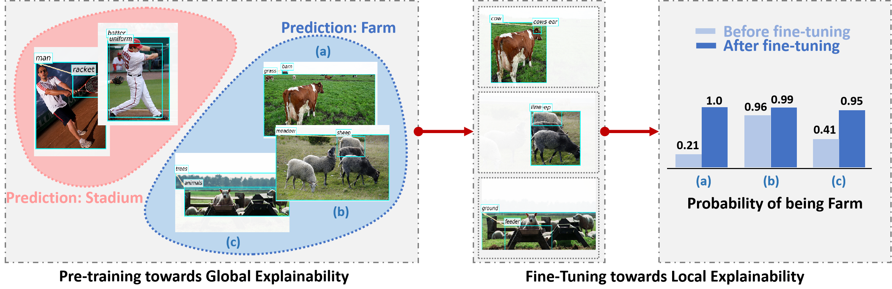

# ReFine: Multi-Grained Explainability for GNNs



This is the official code for **Towards Multi-Grained Explainability for Graph Neural Networks (NeurIPS 2021)**. Besides, we provide **highly modularized** explainers for Graph Classification Tasks. Some of them are adapted from the image domain. Below is a summary:

|Explainer|Paper|
|:---|:---|
|ReFine|Towards Multi-Grained Explainability for Graph Neural Networks|
|SA|Explainability techniques for graph convolutional networks.|
|Grad-CAM|Explainability Methods for Graph Convolutional Neural Networks.|
|DeepLIFT|Learning Important Features Through Propagating Activation Differences|
|Integrated Gradients|Axiomatic attribution for deep networks|
|GNNExplainer|GNNExplainer: Generating Explanations for Graph Neural Networks|
|PGExapliner|Parameterized Explainer for Graph Neural Network|
|PGM-Exapliner|PGM-Explainer: Probabilistic Graphical Model Explanations for Graph Neural Networks|
|Screener|Causal Screening to Interpret Graph Neural Networks|
|CXPlain|Cxplain: Causal Explanations for Model Interpretation under Uncertainty|

## Installation
**Requirements**
- CPU or NVIDIA GPU, Linux, Python 3.7
- PyTorch >= 1.5.0, other packages

1. Pytorch Geometric. [Official Download](https://pytorch-geometric.readthedocs.io/en/latest/notes/installation.html).

```
# We use TORCH version 1.6.0
CUDA=cu102
TORCH=1.6.0 
pip install torch-scatter -f https://pytorch-geometric.com/whl/torch-${TORCH}+${CUDA}.html 
pip install torch-sparse -f https://pytorch-geometric.com/whl/torch-${TORCH}+${CUDA}.html
pip install torch-cluster -f https://pytorch-geometric.com/whl/torch-${TORCH}+${CUDA}.html
pip install torch-spline-conv -f https://pytorch-geometric.com/whl/torch-${TORCH}+${CUDA}.html
pip install torch-geometric==1.7.0
```
2. Visual Genome (optional). [Google Drive Download](https://drive.google.com/file/d/132ziPf2PKqjGoZkqh9194rT17qr3ywN8/view?usp=sharing).
  This is used for preprocessing the VG-5 dataset and visualizing the generated explanations. 
  Manually download it to the same directory as `data`. (This package can be accessed by API, but we found it slow to use.) You can still run the other datasets without downloading it.

3. Other packages
  ```
  pip install tqdm logging pathlib argparse json pgmpy==0.1.11 
  # For visualization (optional) 
  conda install -c conda-forge rdkit
  ```

## Datasets

1. The processed raw data for `BA-3motif` is available in the` data/` folder.
2. Datasets `MNIST`, `Mutagenicity` will be automatically downloaded when training models.
3. We select and label 4443 graphs from https://visualgenome.org/ to construct the **VG-5** dataset. The graphs are labeled with five classes: stadium, street, farm, surfing, forest. Each graph contains regions of the objects as the nodes, while edges indicate the relationships between object nodes. 
Download the dataset from [Google Drive](https://drive.google.com/file/d/1zFHyLTZm0N0Ckylx5aqfG-jRdlywBPXP/view?usp=sharing). Arrange the dir as 
```
data ---BA3
 |------VG
        |---raw
``` 
Please also cite Visual Genome ([bibtex](https://dblp.uni-trier.de/rec/journals/ijcv/KrishnaZGJHKCKL17.html?view=bibtex)) if you use this dataset.
## Train GNNs
We provide the trained GNNs in `param/gnns` for reproducing the results in our paper. To retrain the GNNs, run
```
bash gnns/run.sh
```
The trained GNNs will be saved in `param/gnns`.

## Explaining the Predictions
1. For global training of PGExplainer and ReFine, run
```
bash gnns/run.sh
```
2. Load datasets
  ```python
  import torch
  from utils.dataset import get_datasets
  from torch_geometric.data import DataLoader
  name = 'ba3'
  train_dataset, val_dataset, test_dataset = get_datasets(name=name)
  # filter out test data with wrong predictions
  mask = torch.load(f'param/filtered/{name}_idx_test.pt')
  test_loader = DataLoader(test_dataset[mask], 
                            batch_size=1, shuffle=False)
  ```
3. Instantiate the explainer
```python
from explainers import *

device = torch.device("cuda")
gnn_path = 'param/gnns/ba3_net.pt'

refine = torch.load(f'param/refine/{dataset}.pt') # load pretrained
refine.remap_device(device)
```
4. Explain
```python
ratios = [0.1 *i for i in range(1,11)]
refine.explain_graph(test_dataset[0], fine_tune=True, 
                     ratio=0.4, lr=1e-4, epoch=20)
```
For baseline explainers, e.g.,

```python
gnn_explainer = GNNExplainer(device, gnn_path)
gnnexplainer.explain_graph(test_dataset[0],
                           epochs=100, lr=1e-2)
                           
screener = Screener(device, gnn_path)
screener.explain_graph(test_dataset[0])                 
```     
5. Evaluation & Visualization
Evaluation and visualization are made universal for every `explainer`. After explaining a single graph, the pair `(graph, edge_imp:np.ndarray)` is saved as `explainer.last_result` by default, which is then evaluated or visualized.
```python
acc_auc = refine.evaluate_acc(ratios).mean(),
racall =  refine.evaluate_recall(topk=5))
refine.visualize(vis_ratio=0.3) # visualize explanation
```
## Citation
Please cite our paper if you find the repository useful.
```
@inproceedings{2021refine,
  title={Towards Multi-Grained Explainability for Graph Neural Networks},
  author={Wang, Xiang and Wu, Ying-Xin and Zhang, An and He, Xiangnan and Chua, Tat-Seng},
  booktitle={Proceedings of the 35th Conference on Neural Information Processing Systems},
  year={2021} 
}
```